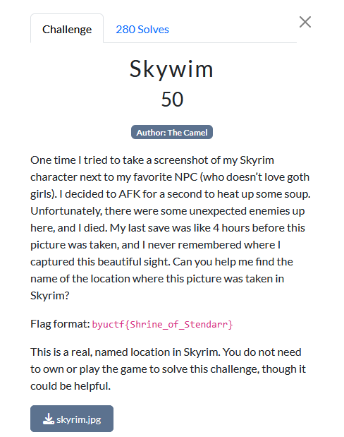
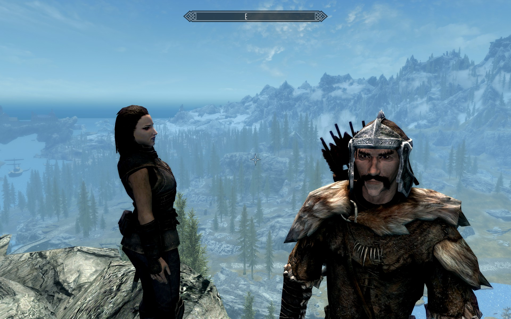
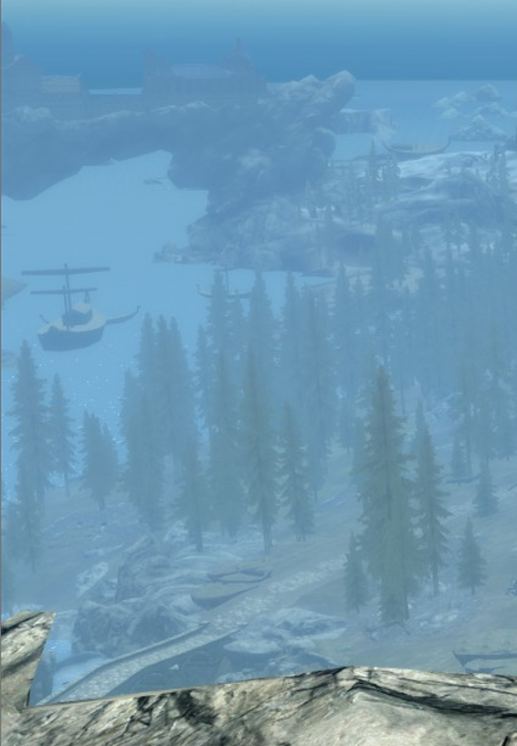
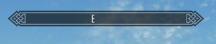
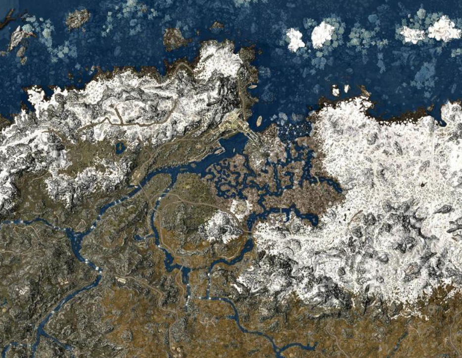
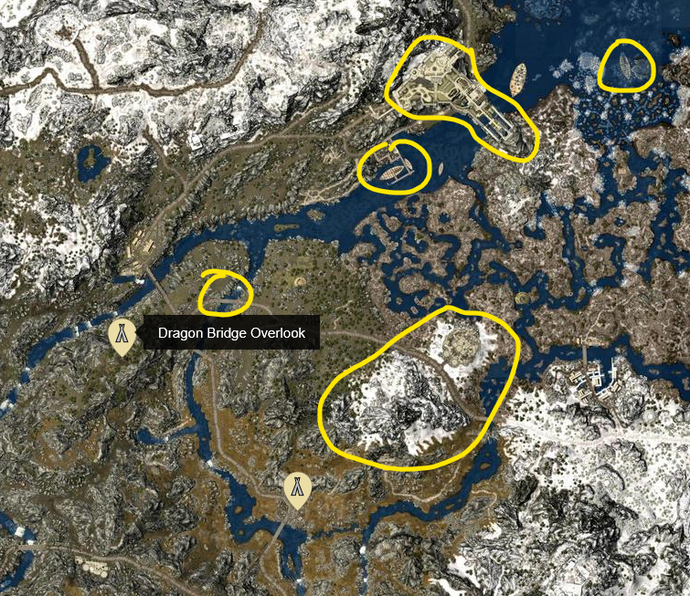

# OSINT challenge

## Skywim

10 bajillion hours of Skyrim finally pays off.

I'm not sure which NPCs are in this photo, maybe someone from the Dark Brotherhood, Companions, or a vampire, but it might not be relevant.

There is a map of Skyrim that can be referenced without needing to boot up the game here: https://mapgenie.io/skyrim/maps/skyrim

There are some details that can clue us to where this picture was taken, seen in the crop below. One boat on the far left, another in the top right, some sort of structure in distance in front of an ocean (top), and a bridge (bottom).

The compass shows us facing almost directly east towards a mountain range. This means the ocean is north-east of here.

The one region that sticks out on the map is this one.

The bridge, bots, structure, ocean, and mountain range all seem to match. Bringing up the legend allows us to look at nearby named locations.

The flag is **byuctf{Dragon_Bridge_Overlook}**
