## l33t-Benign (Part 2 of 133t-dangerous)

Part 2 description: Find out who was else was affected.

---

NAVI is eager to hack someone. And of course, the original name was NAVI in the script. CacheTheStamp3de also apparently can see all creds from all users, including konata's.

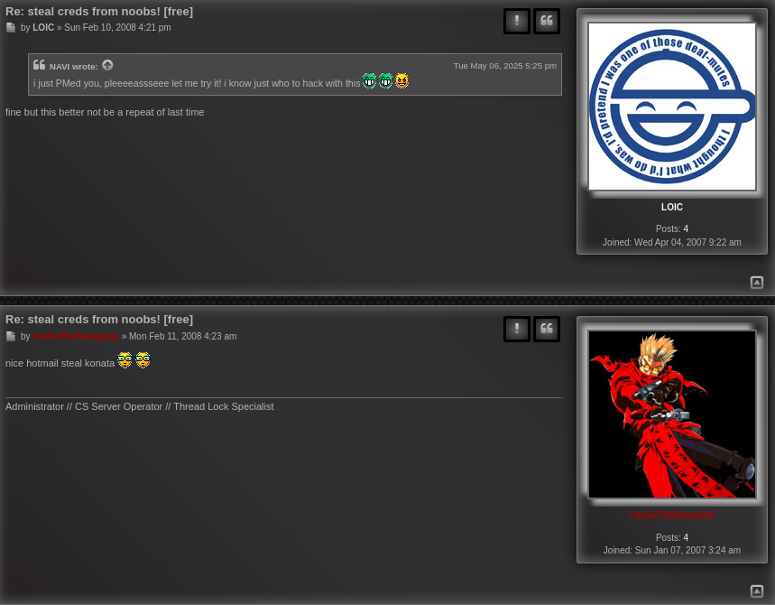

LOIC also provides a private key for the SAML login page, implying its vulnerable. This is how we can pretend to be another user.

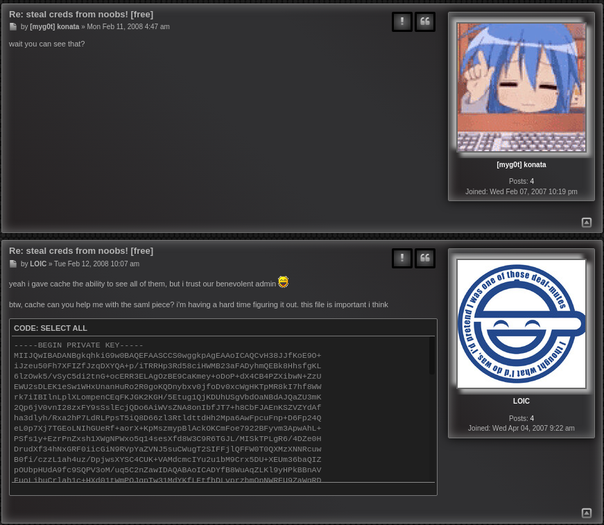

As LOIC pointed out, Logging into the SimpleSAML page will show credentials if your username is linked to what was stolen. Since this account is new, it is empty.

However, if logged in, any account can see a list of credential UUIDs as a response.

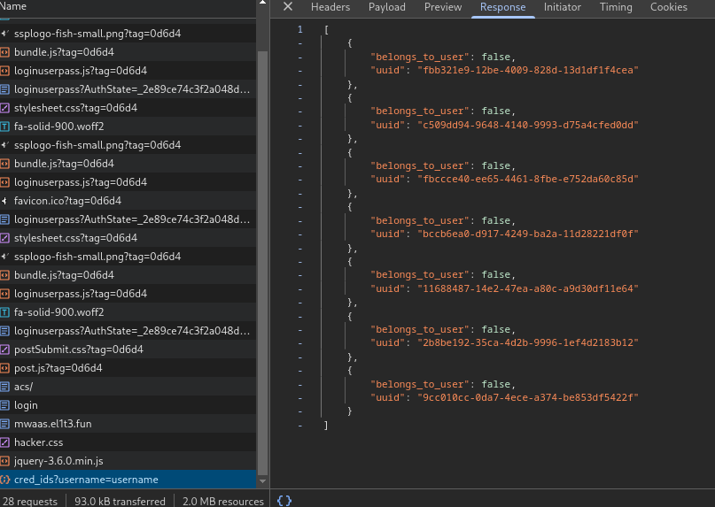

Using Burp Suite and SAML Raider, the response to the POST on /saml/acs shows a username.

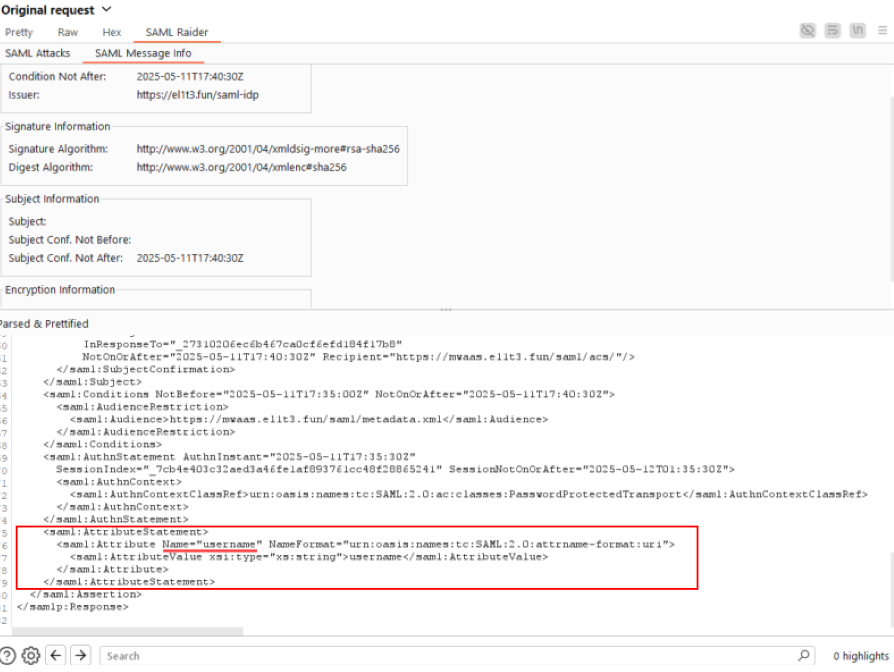

Somewhere in the network responses shows a /get_cred endpoint, although I forgot which one specifically.

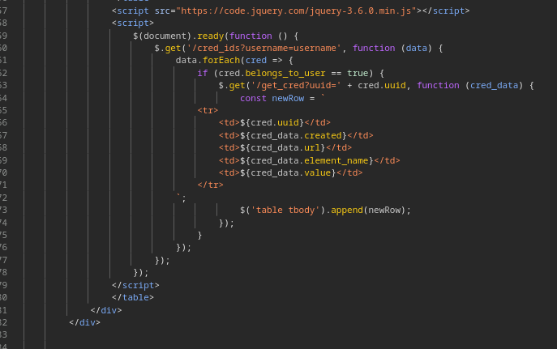

By deleting the signature in this response entirely, and changing the username, we can 'become' other users and see credentials linked to their account with the /get_cred endpoint.

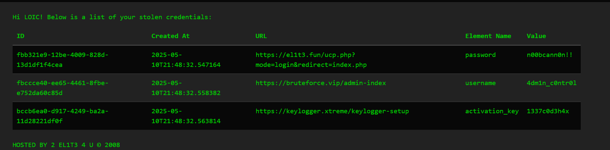

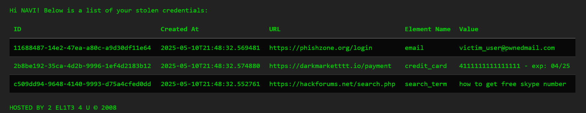

But for some reason they are not shown when it comes to CacheTheStamp3de, the user that supposedly has access to all credentials.

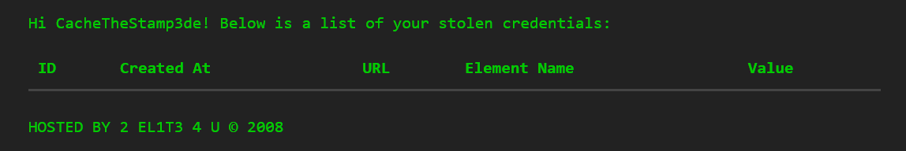

Looking closer at the public UUIDs, this one stands out as not on either LOIC or NAVIs accounts.

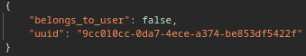

Trying to get this one directly will show message:

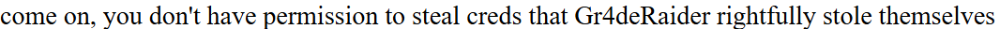

Who is Gr4deRaider? By retrying the SAML response as this user, the flag is revealed.

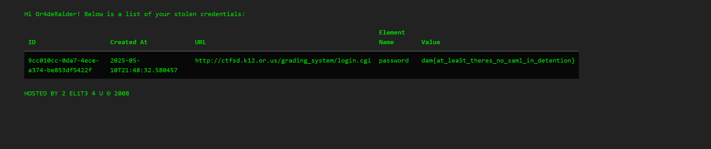
