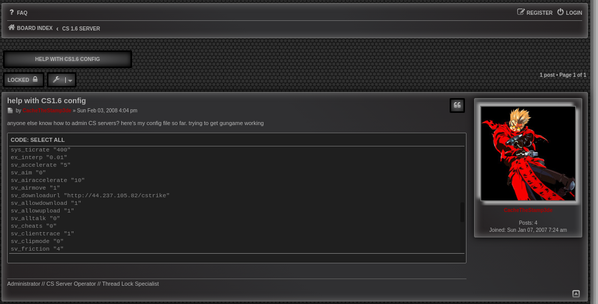
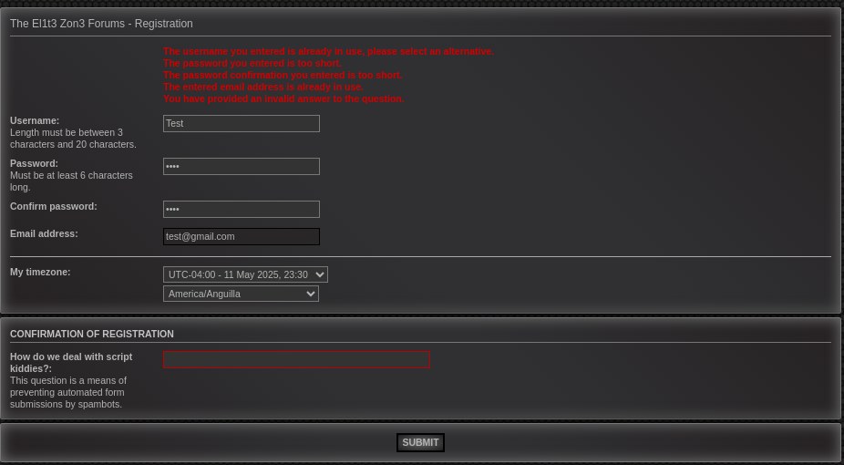

## 133t-dangerous

A `boom.crx` file is provided that probably contains malware based on the description.

A `.crx` can be changed to a `.zip` and then unzipped to get the `content-script.js` and `manifest.js` files.

Inspecting `content-script.js`, there is a very long Audio object called `boom`.

At this the bottom of the file is a hint: A TODO statement about CORS, and a simulated response. Below this, a POST request to a URL `https://mwaas.el1t3.fun/payload`, passing in a JSON that contains information about an input field, and a user: "NAVI".

Using `curl` to make this request via command-line responds with an interesting statement about the disappearance of CacheTheStamp3de.

Going to the website directly shows an sparse page because we are not logged in.

Clicking a nearby login button leads to this page. At this point, I'm still not certain what it's used for yet.

The base website `el1t3.fun` appears to be a counter-strike hacking/cheating forum with CacheTheStamp3de as an admin, and NAVI and others as users.

One of the public posts by CacheTheStamp3de has a download_url inside a cs config file.

At that IP address all of the map files can be downloaded, although they may not be relevant.

Also at this IP is a 'message-of-the-day' banner, holding the IP for a teamspeak server.

Both of these IPs aren't necessary to solve for the flags.

However, the teamspeak server is password protected.

One post by CachedTheStamp3de implies they worked in IT, possibly related to the hint in the original challenge.

One post shows NAVI likes the map office, which to the best of my knowledge is not a game mode. I wonder if this is a hint?

One post is of NAVI's video. It has a gnarly retro vibe with Linkin Park playing in the background as NAVI goes through their filesystem to give 'legit proof' they aren't hacking.

In this one there is a `Cheat Engine` folder.

Navi was playing the gungame server that CachedTheStamp3de made.

NAVI also leaks their STEAM ID in the footage when the console is open.

Using STEAMFINDER online reveals the profile links for NAVI and POOTIS

On NAVI's steam profile, CacheTheStamp3de made a comment.

On pootis's account, they are friends with konata and CacheTheStamp3de.

On konata's account, they are friends with CacheTheStamp3de, pootis, and LOIC and a member of Skid Force Zero

CacheTheStamp3de's and LOIC's profiles are private.

On Skid Force Zero's page, there are public comments that reveal a teamspeak password.

There are a few hidden posts that can't be seen without making an account.

On the login page, there is a passphrase that must be known in order to make an account. "How do we deal with script kiddies?"

Well it turns out this passphrase is revealed in the teamspeak channel description

After making an account, the flag is revealed within a hidden post. It looks like LOIC is the one who created the malicious chrome extension. According to the post, the creds get sent to the `mwaas.el1t3.fun` page when you are logged in. This implies that if we can log into another user's account we can see what creds they stole using this extension.

Continued in l33t-benign.

## References

Credit: The pathway that was used originally to this flag was guessing 'username' and 'password' as a login out of pure luck, and it was most likely was created by another team. This path was used by `Battlestarcheese` on Discord, a fellow member of my cybersecurity club.

The original guide provided me with the insight to use the Steam ID Path.

Original guide: https://gitlab.com/osusec/damctf-2025-challenges/-/tree/main/misc/l33t-dangerous?ref_type=heads
