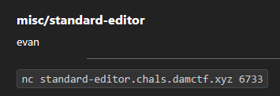
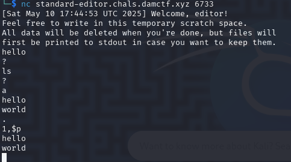
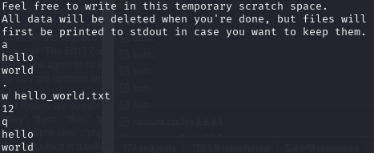
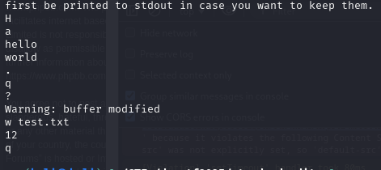
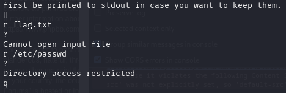
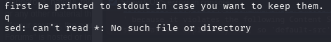

## standard-editor

The starting point is a netcat connection. Upon connecting, a message tells us that we can write files to the scratch space, and when finished it will print it to stdout.

At first, any input seemed to always respond with a single `?`.

However, after trying out a few different strings, the editor appears to be interpreting `ed` commands.

`a` begins append mode, `.` ends the append mode, and `1,$p` will print lines.

`w` is used to write to a file. `q` is used to quit `ed`. So, by writing a file and then quitting, the stated functionality of printing that to stdout appears to be working.

`H` allows error messages. For some reason, if a quit is attempted before a write, even if the file is still written afterwards and an actual quit occurs, stdout is not printed after all.

There is no way to tell if there's a flag in this directory already, and attempting to read from any other directories is not allowed.

Another thing is if a quit occurs immediately, there is an error message from `sed`.

I did not know how to exploit this at the time and the rest of this walkthrough is available from referencing the public write-ups.

https://gitlab.com/osusec/damctf-2025-challenges/-/tree/main/misc/standard-editor/solve
