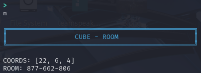
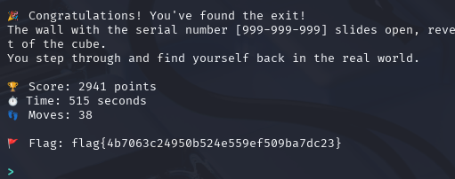

# Cube

This one appears to be narratively-driven. I like these! I'm in a cube, with six directions to move and a note scribbled on the wall that says to `GO TO THE EDGES` and `1, 17, ...`.

Each room apparently gets coordinates (this one [22, 7, 4]) and a serial number. Inspecting seems to only give back the serial number. Maybe if I'm in the room with the flag this inspect button will display the flag.

Moving north changes the middle serial number by -1.

The inspection of this room mentions 'sensors'?

After moving north again, there is 'reflective material'.

There is a game over mechanic if I enter the wrong room it seems. The 'gravity' became too much.

Making note of the room in question that is a 'trapped room': `128-125-554`

After restarting, the coordinates are different, and the result on going north 3 times in a row again leads to a fiery death in room `414-004-546`.

So it seems that this is a maze problem.

The natural question is: How can I get to the flag without going into any of the death rooms?

Another thing to consider is what is the minimum or maximum number that a coordinate can be?

By playing a few more times we see that going south gives +1 to the Y coordinate, but this isn't allowed beyond 26.

Similarly, moving up adds +1 to the Z coordinate and is not allowed beyond 26.

Trying to go west, which adds -1 to the X coordinate, is not allowed.

So it seems the range is [1-26] for all directions. Barring no other suprises, this means the maze has 25x25x25 = 15,625 possible rooms.

But if the hint is to be believed, the flag will be in one of only 25 possible positions of 1, 17, [1-26].

I noticed as I played more games that I usually die faster if I keep going in the same direction. What if this is because I'm going too far away from the flag?

IDEA: What if I try to take the most direct route to the range of points that the flag could be in?

New game. Coordinates: [12, 12, 14].

Using Desmos's pre-built Parametric line tool and plugging in this starting coordinate and the coordinate of the mid-point of the possible flag range, I can move this T slider and see the g(T) coordinates outputted.

I move the slider only a little bit at a time, and each time one of the coordinates gets close to an integer value, I choose a direction that would reflect that in the game. For example, as I move the slider, X reaches the next integer first at exactly 11, I then choose 'west' to change my X in the game to 11.

By following this process, I make it all the way to [1, 17, 14] without entering a death room. Now I just have to guess which direction the flag is in, up or down? I choose down.

Eventually I reach a room which is adjacent to a room with a serial number of all 9s

This serial no. stands out and going to this room reveals the flag.

The flag is `flag{4b7063c24950b524e559ef509ba7dc23}`.

## Accidental Solution

HOWEVER: This solution was not reproduceable on subsequent games, so there is more to this puzzle than that, and I probably got lucky.

I found out about a move called _Cube_. In this movie, people are in a maze of trapped cubic rooms, where the traps can be discovered based on the certain patterns in the serial numbers.

I haven't watched the movie myself so but I read one condition was any of the numbers being prime numbers = Trapped Room.

However this also isn't always true in this CTF challenge, so maybe there is another pattern?

## Post-Competition

I read someone said the math trick from the movie is if any of the numbers is the power of a prime, then the room is trapped.

By using an altered sieve of eratosthenes script from GeeksForGeeks, called prime_power.py here. We can get the flag from any position.

## Notes

What does the hint "GO TO THE EDGES" mean? Is this something from the movie?
