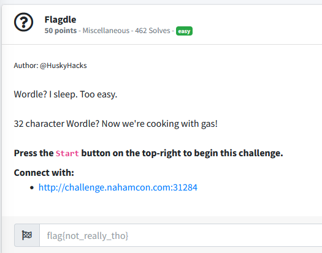
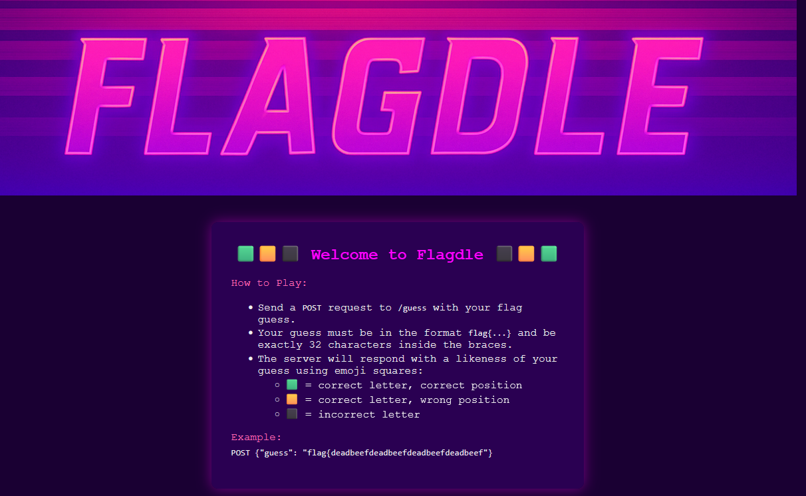
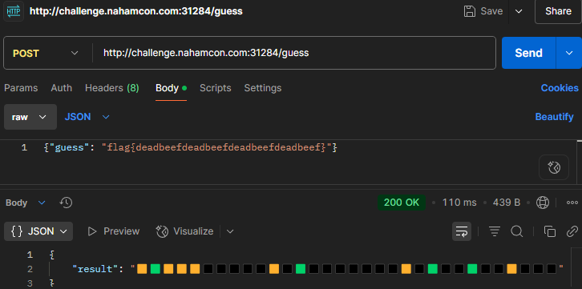
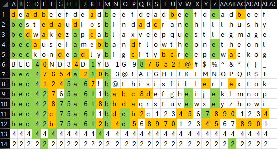

# Flagdle

The given website looked like this:

Using postman, my first guess was the example given to see if it works.

Then, I messed around with different formats like lowercase, uppercase, numbers and symbols. I attempted to record my results in a small spreadsheet. After realizing that I had been making mistakes in which to track, and that this is just taking too long I wanted to brute force (by hand since it's small enough). I used each character in the range a-f and 0-9, repeated 32 times to get their positions.

The flag was `flag{bec42475a614b9c9ba80d0eb7ed258c5}`
