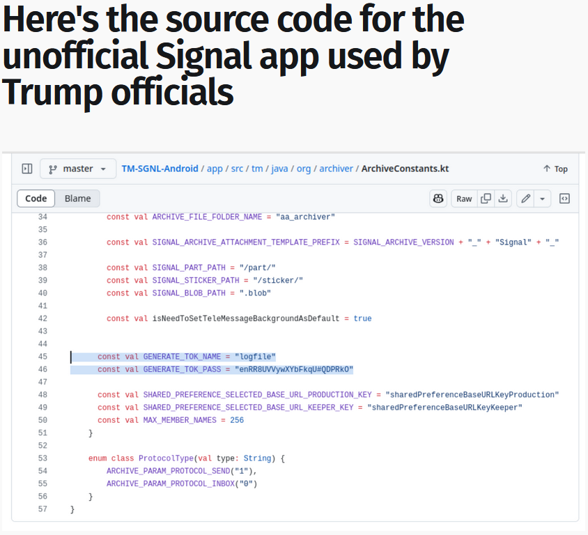

# Sending Mixed Signals

The website has this form:

Looking up the name of the mock-version: TM Signal

Looking up the source code.

The relevant hard-coded credential is shown in the article:

https://micahflee.com/heres-the-source-code-for-the-unofficial-signal-app-used-by-trump-officials/

The article doesn't show the the author or commit information, so I found the repository online.

On GitHub you can find the email associated with a commit by cloning the repo and looking at the git log on this commit. However, Davidt's email turned out to be incorrect? Why? Because Davidt's commit is just moving things to a new folder during this 7.2.4.2 Release This implies the credential existed before this release somewhere else.

This command just adds all of the release names into a file

Below is a PowerShell script that looks through all of the releases for this credential and finds the first instance of it and the file.

After running, the result was `Release_5.4.11.20`, and the file in question was just in `main` instead of `tm` like the originally seen commit from `Davidt`.

This release name is the answer for part 3.

Running `blame` on this file shows it was `moti` and not `Davidt` that actually added hard-coded this credential.

Running `show` for the commit on this line gives back the email needed for part 2:

The flag was: flag{96143e18131e48f4c937719992b742d7}.

