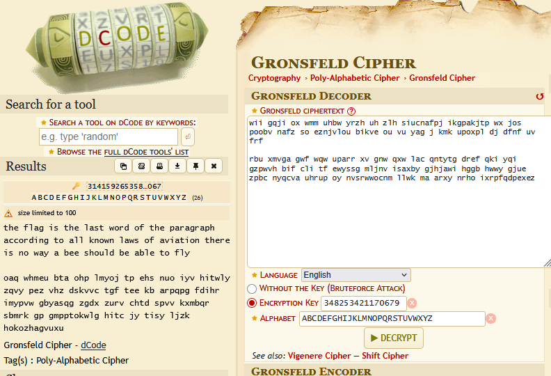
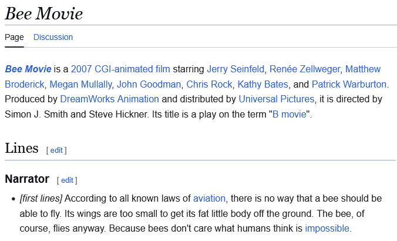
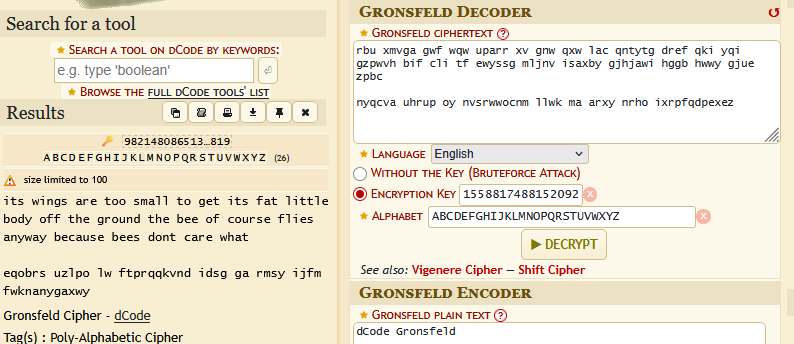
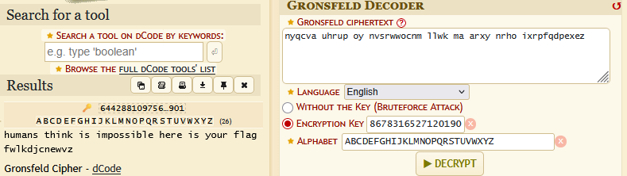

# Crypto

## Count von Count

The ciphertext is given:

```
wii gqji ox wmm uhbw yrzh uh zlh suicnafpj ikgpakjtp wx jos poobv nafz so eznjvlou
bikve ou vu yag j kmk upoxpl dj dfnf uv frf rbu xmvga gwf wqw uparr xv gnw qxw lac
qntytg dref qki yqi gzpwvh bif cli tf ewyssg mljnv isaxby gjhjawi hggb hwwy gjue
zpbc nyqcva uhrup oy nvsrwwocnm llwk ma arxy nrho ixrpfqdpexez
```

A hint is given in the challenge description. `Gronsveld` is close to `Gronsfeld`, which is a type of cipher.

The `Gronsfeld` cipher requires some key that determines the shift of each character.

One good place to start is to make an assumption about the text. Here, can make a guess that the first word, a 3-letter word, might be the word `the`.

With each character representing its index in the alphabet:

| Character | Index 1 | Decrypted Character | Index 2 | Key (Index 1 - Index 2) |
| :-------- | :------ | :------------------ | :------ | :---------------------- |
| w         | 22      | t                   | 19      | 3                       |
| i         | 8       | h                   | 7       | 1                       |
| i         | 8       | e                   | 4       | 4                       |

The key that would to `wii` back into `the` in this cipher would be `314`.

This number looks familiar. Is is the first 3 characters of pi.

To continue this guess, let's add more characters of pi and see if it spits out meaningful text.

Using `dcode.fr`, and adding many digits of pi, results in nearly the first half of the cipher being decrypted.



```
the flag is the last word of the paragraph according to all known laws of aviation there is no way a bee should be able to fly

oaq whmeu bta ohp lmyoj tp ehs nuo iyv hitwly zqvy pez vhz dskvvc tgf tee kb arpqpg fdihr imypvw gbyasqg zgdx zurv chtd spvv kxmbqr sbmrk gp gmpptokwlg hitc jy tisy ljzk hokozhagvuxu
```

With a quick search you can find the sentence is a quote from the film _Bee Movie_ (2007).



But there is more to this quote, and what's interesting is the rest of the quote's words have counts that match the next encrypted portion for each word.

| Quote Word | Length | Encrypted Word |
| ---------- | ------ | -------------- |
| Its        | 3      | oaq            |
| wings      | 5      | whmeu          |
| are        | 3      | bta            |
| too        | 3      | ohp            |
| small      | 5      | lmyoj          |
| ...        | ...    | ...            |

The key seems to stop working after the 100th digit of pi on `dcode` as any additional digits seems to have no impact on the decrypted text.

The first 100 digits of pi are:

```
3141592653589793238462643383279502884197169399375105820974944592307816406286208998628034825342117067
```

So taking the original cipher but starting with the second portion beginning with `rbu`, and the next 100 digits of pi, the next portion is deciphered.

The next 100 digits of pi:

```
9821480865132823066470938446095505822317253594081284811174502841027019385211055596446229489549303819
```



```
its wings are too small to get its fat little body off the ground the bee of course flies anyway because bees dont care what

eqobrs uzlpo lw ftprqqkvnd idsg ga rmsy ijfm fwknanygaxwy
```

There are 49 characters remaining not including spaces. Following the same pattern and starting at `nyqcva` for the next 49 digits of pi:

```
6442881097566593344612847564823378678316527120190
```



```
humans think is impossible here is your flag fwlkdjcnewvz
```

The last encrypted word `fwlkdjcnewvz` seems to imply there is another level of decryption required. But this is actually the **flag**.
