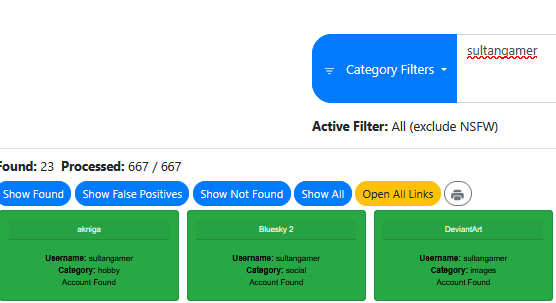
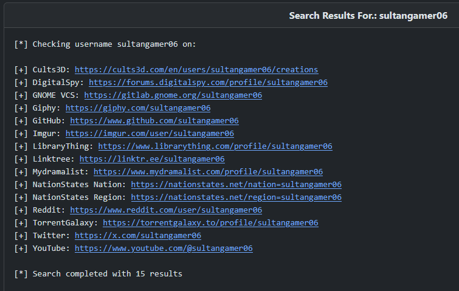

# OSINT

## Piotr

In this sequence of challenges, we have to find out where Piotr (a fake person) was on certain days. All we know in the beginning is that he is associated with San Diego's **ACM** branch.

### Initial Recon

Going to the **ACM** website and looking through the officers we find the man, his last name and his **LinkedIn** page.

Screenshot credit: Lizazal on GitHub.

https://www.linkedin.com/in/piotr-sultanbekov/

The Bio contains a link to Piotr's **GitHub** website

The education section shows Piotr has an interest in **Smash Club**, which is referencing the video game series _Super Smash Bros_, available on various Nintendo consoles.

The GitHub website has a link to the actual GitHub account in the footer: **sultangamer06**

The about page tells us that Piotr's favorite character to play as in _Smash Bros_ is **Isabelle**.

Piotr's GiHub profile is sparse except for one repository with 13 commits.

Commit e8e80a6 hints that Piotr has an account on X, formerly known as Twitter.

There are also 11 deployments of this repository.

One of these is a failed deployment, which shows the X-formerly-known-as-twitter handle: **sultangam3r**

Following this trail, we find the account has **Isabelle** in the banner, and a **Truth Social** profile: **sultangamer**

Piotr's **Truth Social**

## Day 4: What city did Piotr go to May 7th?

One post on Truth Social has an image of a gas station. Piotr says it's in Texas, but it doesn't look like Texas. There are lots of different languages on the signage, one of which says **STB Bank**

**STB Bank** is a state bank headquartered in **Tunis**, Tunisia.

Here is the logo of the bank. It looks similar to the photo.

**Tunis** is the flag.

## Day 5: What city did Piotr go to on May 8th?

The latest post on Truth Social has Piotr saying he's going to where the "sky is bluer". This is a hint to the website **Bluesky**.

Using `whatsmyname.app` on `sultangamer` gives a positive result for **Bluesky**

Piotr's last name matches the account.

This account is also following UC San Diego.

Posts from May 8th imply that Piotr may have been as a **Super Smash Bros Tournament**, but couldn't stay for the main event. The first part of the this is written in **German**.

Back on the X-formerly-known-as-twitter account, Piotr is following a **German** **Smash Melee Tournament** account.

Googling for these details gives a result of a tournament in **Großlohra**.

The flag is **Großlohra**.

## Day 6: What city did Piotr go to on May 9th?

On Bluesky, Piotr mentioned needing to "go somewhere important tomorrow" on May 8th.

Then on May 9th, this post.

The language is **Kazakh**, the language of **Kazakhstan**.

Using bing for "Piotr Sultanbekov" gives this result of vk.com, which has **ditto.ai**

**ditto** is another account that Piotr follows on X-formerly-known-as-twitter.

This bio contains UCSD, and when the russian is translated, confirms that this is our Piotr, because it's the same bio as on Truth Social.

The latest post on VK is blurred, but is dated for May 9th.

The map location at the top of the post can be translated to **Baikonur**.

Baikonur contains the Baikonur Cosmodrome in Kazakhstan, which is a space launch facility. The image is a blurred image of an astronaut.

The flag is **Baikonur**.

## Day 3: What city did Piotr go to on May 6th?

Using `sultangamer06`, the username from GitHub, and searching with `osint.rocks`, a number of results are returned. Most of these are false positives.

Imgur however, is related.

Even though the account is empty originally.

If we google search `imgur sultangamer06`, 3 results comes back. that are related.

The third is dated for May 9th. He went to a **magdalena bay** concert on Tuesday, which is May 6th.

Searching for past concerts by this artist on songkick.com shows the city Piotr was in.

The flag is **Buffalo**

## Day 2: What city did Piotr go to on May 5th?

Backtracking, the ACM UCSD Instagram followers list appears to have Piotr.

The first post is Piotr at a beach on May 5th. Which beach?

Using a Google reverse image search, this pier is located at Kitty Hawk, North Carolina.

The flag is **Kitty Hawk**.

## Day 1: What city did Piotr visit on May 4th?

On X-formerly-known-as-twitter, Piotr made a post on May 4th saying they were leaving San Diego to find love. Where did he go?

Looking at who Piotr's following shows one account **Plumeria**

**Plumeria** is a dating app, according to their website at https://goplumeria.com/

Another post on the Instagram has a hashtag that could be unique to Piotr.

A google search for this hashtag returns a Reddit result.

One of the commenters has a variant of the sultan gamer username and uses this hashtag.

One of the posts by this user has a QR code for a party on May 2nd. Not the date we need, but could be related.

Scanning this QR code links to a **Plumeria** schedule on May 4th, for the "most pedestrian-friendly city in America". Which city is this?

Looking up **Buffalo Bayou Park Cistern** and **Rice University** will lead to Houston, Texas.

The flag is **Houston**.
