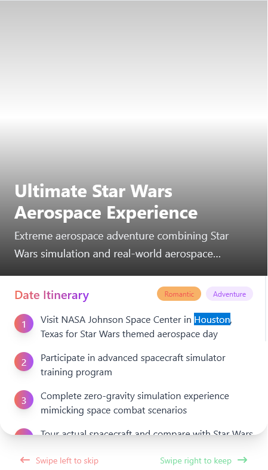
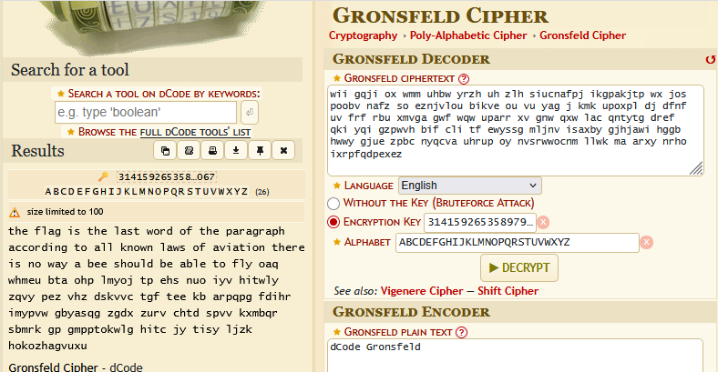

Prompting the website for "star wars themed" dates.
https://goplumeria.com/plan

=============================

## Count von Count

'Gronsveld' -> Gronsfeld. The first word I assumed was 'The', which is a very common way to begin sentences. When I noticed the key to make this 'The' was the first 3 digits of Pi, I added more digits of pi and got this output.

"the flag is the last word of the paragraph according to all known laws of aviation there is no way a bee should be able to fly oaq whmeu bta ohp lmyoj tp ehs nuo iyv hitwly zqvy pez vhz dskvvc tgf tee kb arpqpg fdihr imypvw gbyasqg zgdx zurv chtd spvv kxmbqr sbmrk gp gmpptokwlg hitc jy tisy ljzk hokozhagvuxu"
