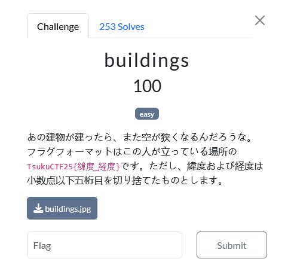
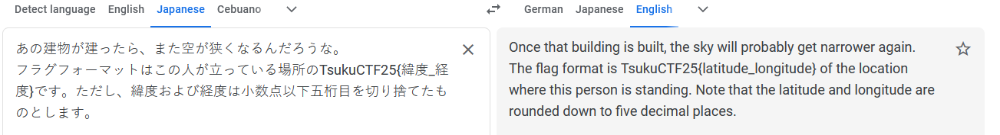
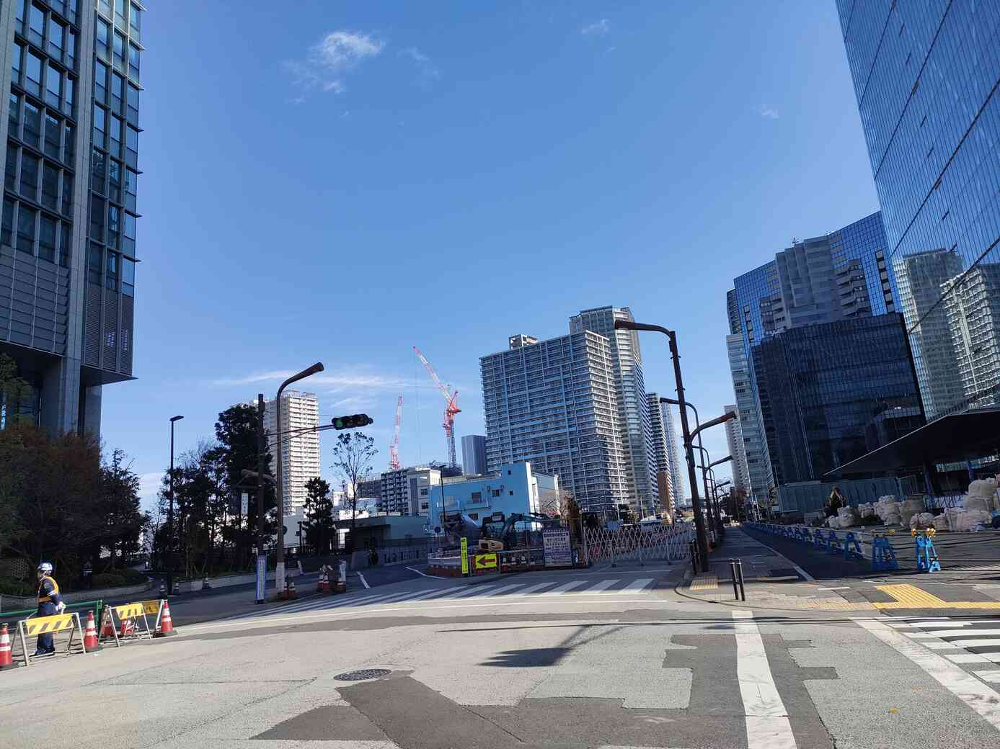
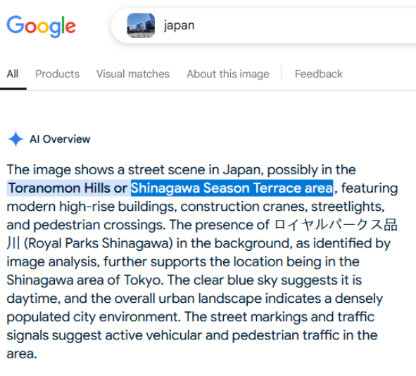
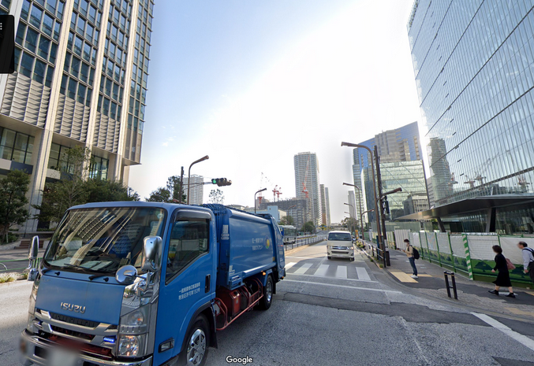
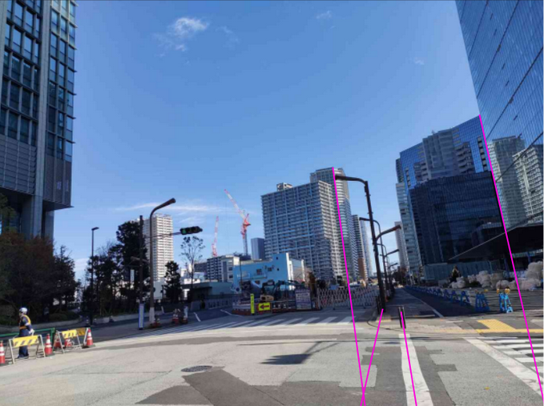
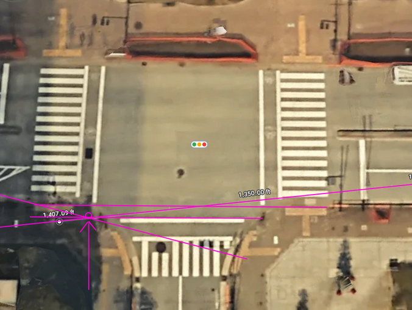

# OSINT

## buildings

I don't know Japanese so I relied on Google Translate to describe this challenge. I'm seeking the coordinates of where the photographer was standing, rounded down to 5 decimal places.

The image that is given is this one.

Using Google to perform a reverse image search.

Searching Google Maps for 'Shinigawa Season Terrace area' leads right to this nearby intersection, which is the correct location.

To get an approximate location, I drew lines on the image from the camera's perspective.

One line is from the light pole across the road, which appears to pass the photographer on the left.

A second line following the crosswalk line passes the photographer on the right (or perhaps right on top). Therefore the photographer must be between these lines in latitude.

Two additional lines follow the edge of the buildings and intersect with the crosswalk bars.

Adapting these lines to an aerial view on Google Maps shows the intersection point, which is probably pretty close to the exact position. The coordinate can be retrieved by clicking at this point on the map.

NOTE: It turns out that the challenge description (or at least the translation) was incorrect. The correct flag is truncated to 4 decimal places for both latitude and longitude, and not 5.
